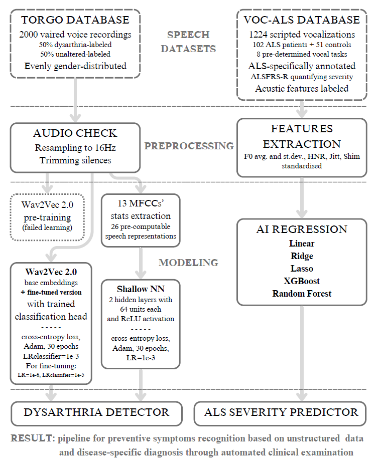

# Machine Learning Practical Project
## Automatic speech analysis for dysarthria recognition and ALS diagnosis

Amyotrophic Lateral Sclerosis (ALS) is a severe neurodegenerative illness that affects motor and speech functions, often presenting dysarthria — impaired vocal articulation due to weakened muscular control — as an early symptom. This [research](MLP-Report.pdf) examines the potential of audiometric biomarkers to uncover ALS’ progression exploring both Machine Learning (ML) and Artificial Intelligence (AI) techniques.

Two data sources are used: the TORGO database [(Rudzicz et al., 2012)](https://www.cs.toronto.edu/~complingweb/data/TORGO/torgo.html), which contains a wide range of dysarthric and healthy voice samples, and the VOC-ALS dataset [(Dubbioso et al., 2024)](https://www.nature.com/articles/s41597-024-03597-2), comprising structured clinical and acoustic information on ALS patients and control individuals, together with the corresponding ensemble of scripted audio recordings.

The primary objective is to merge the results of these studies and build a detection system able to identify dysarthria and, eventually, distinguish the cases caused by sclerosis. A state-of-the-art deep speech representation strategy known as Wav2Vec 2.0 [(Baevski et al., 2020)](https://arxiv.org/abs/2006.11477) is applied [as is](Wav2Vec.ipynb) then [fine-tuned](Finetuning.ipynb) on the TORGO instances to recognise patterns in vocal deterioration and spot dysarthric voices. Afterwards, different AI methods are used on the ALS-labelled dataset to create a [disease-specific detector](Voc-als.ipynb) based on predetermined vocalisations with diverse [predictive powers](FeautureImportance.ipynb). This approach has the potential to support early diagnosis and monitoring in clinical and remote settings.

### Methodology flowchart

